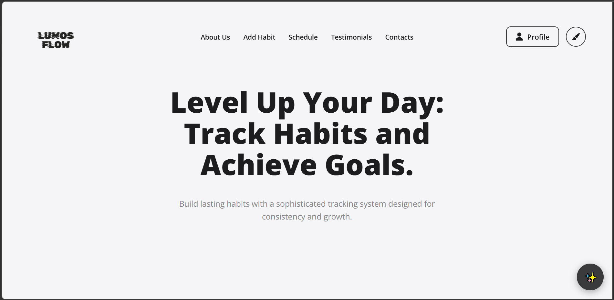
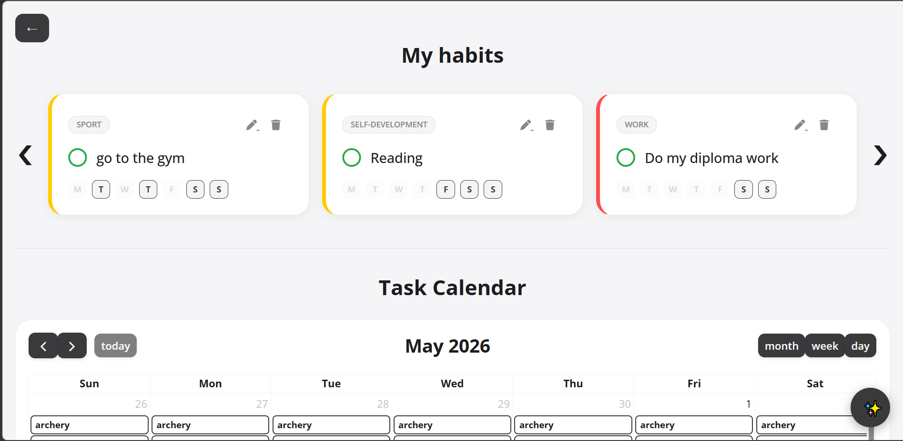
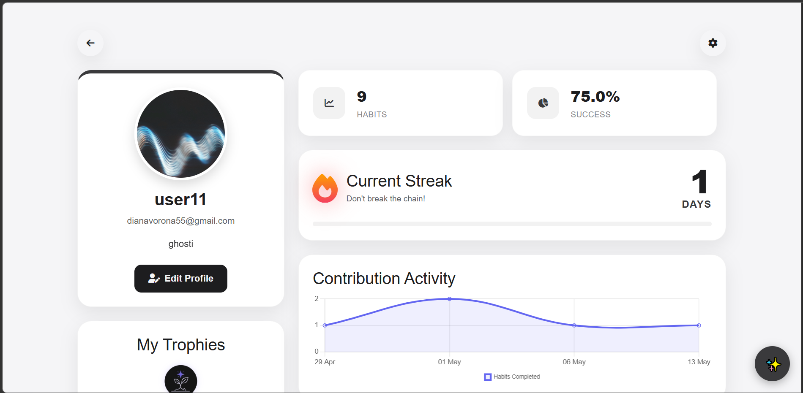
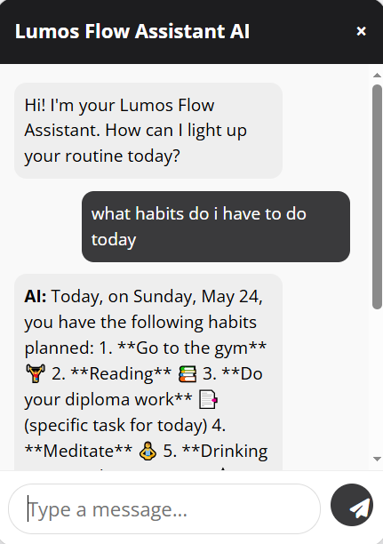

Lumos Flow

Розробка AI асистента для веб-сервісу планування, відстеження звичок і мотивації користувачів

---

Автор

- ПІБ: Шиманська Діана
- Група: ФеС-42
- Керівник: ас. Парубочий В.О
- Дата виконання: 24.05.2026

---

Загальна інформація

- Тип проєкту: Веб-сервіс
- Мова програмування: Python
- Фреймворки / Бібліотеки: Django, Django REST Framework, Bootstrap 5, Chart.js, OpenAI API

---

Опис функціоналу

- Реєстрація, авторизація та керування профілем користувача
- Створення, редагування, видалення та відстеження звичок
- Календарний розклад звичок і одноразових завдань
- AI-асистент на базі GPT-4o-mini з підтримкою tool calling
- Статистика та візуалізація прогресу через Chart.js
- Система гейміфікації: streaks, досягнення, прогрес-бари
- Три теми оформлення: світла, темна, мотиваційна

---

Опис основних файлів

| Файл                       | Призначення                                       |
|----------------------------|---------------------------------------------------|
| `service/models.py`        | Моделі даних (Habit, Task, Progress, Achievement) |
| `service/views.py`         | Контролери бізнес-логіки                          |
| `service/signals.py`       | Автоматизація через Django сигнали                |
| `ai_assistant/services.py` | Сервісний клас AIAgentService                     |
| `ai_assistant/views.py`    | API-ендпоінт для AI-чату                          |
| `templates/`               | HTML-шаблони інтерфейсу                           |
| `static/css/themes.css`    | Теми оформлення                                   |
| `static/js/`               | JavaScript для асинхронної взаємодії              |

---

Як запустити проєкт

1. Встановлення інструментів

- Python 3.12+
- PostgreSQL 17

2. Клонування репозиторію

```bash
git clone https://github.com/dianajnxv/Lumos-Flow
```

3. Встановлення залежностей

```bash
pip install -r requirements.txt
```

4. Створення файлу `.env`

Скопіюйте файл `.env.example` та перейменуйте його на `.env` у кореневій папці проєкту.
Відкрийте створений файл `.env` та вкажіть ваші власні параметри підключення до бази даних та API-ключ:
   
SECRET_KEY=django_secret_key_here
DEBUG=True
ALLOWED_HOSTS=localhost,127.0.0.1
DB_NAME=HabitFlow
DB_USER=postgres
DB_PASSWORD=password_here
DB_HOST=127.0.0.1
DB_PORT=5433
OPENAI_API_KEY=openai_api_key_here

6. Виконання міграцій

```bash
python manage.py makemigrations
python manage.py migrate
```

6. Запуск сервера

```bash
python manage.py runserver
```

Відкрити браузер: `http://127.0.0.1:8000`

---

API ендпоінти

Аутентифікація
POST /api/auth/login/ — Автентифікує користувача та ініціалізує безпечний сеанс.

Request Body:
```json
{
  "username": "diana_user",
  "password": "your_secure_password"
}
```

Response (200 OK):
```json
{
  "status": "success",
  "message": "Authentication successful",
  "user": {
    "id": 1,
    "username": "diana_user",
    "email": "user@example.com"
  }
}
```

Управління завданнями
GET /api/tasks/ — Отримує структурований список усіх календарних завдань і звичок для автентифікованого користувача.

POST /api/tasks/ — Створює нове завдання або звичку асинхронно за допомогою Fetch API без перезавантаження сторінки.

Request Body:
```json
{
  "title": "Prepare diploma presentation",
  "priority": "high",
  "due_date": "2026-05-25"
}
```

Response (201 Created):
```json
{
  "id": 42,
  "title": "Prepare diploma presentation",
  "priority": "high",
  "due_date": "2026-05-25",
  "is_completed": false
}
```

DELETE /api/tasks/:id/ — Видалити певне завдання за його ідентифікатором і запустити каскадне очищення даних у базі даних PostgreSQL.

AI асистент
POST /api/chat/ — Надсилає повідомлення природною мовою модулю інтелектуального помічника, який взаємодіє із зовнішнім API gpt-4o-mini та запускає механізм виклику інструментів для автоматичного створення завдань.

Request Body:
```json
{
  "message": "Schedule a coffee break with the team for tomorrow at 10 AM"
}
```

Response (200 OK):
```json
{
  "response": "Task successfully generated and added to your schedule!",
  "action_executed": true,
  "created_task": {
    "id": 43,
    "title": "Coffee break with the team",
    "due_date": "2026-05-25"
  }
}
```
---

Інструкція для користувача

1. Головна сторінка (Landing Page) — доступна всім відвідувачам сайту (до авторизації):
   - Про вебсервіс та відгуки — перегляд загальної інформації про можливості платформи «Lumos Flow» та ознайомлення з умовними відгуками користувачів.
   - Мотивація та інтерфейс — перегляд щоденних мотиваційних цитат та швидке перемикання між світлою і темною темами за допомогою кнопки `Змінити тему` для зниження навантаження на зір.
   - Перехід до системи — кнопка `Увійти`, яка відкриває уніфіковану форму автентифікації з можливістю швидкого перемикання на створення нового профілю (`Зареєструватись`), якщо користувач відвідує сервіс уперше.
  
2. Панель інструментів (Dashboard) — відкривається автоматично після успішного входу в систему:
   - Розклад — основний робочий простір, де користувач може переглядати інтерактивний календар завдань та інтегрований список своїх звичок.
   - Додати звичку — швидка функція створення нової звички або картки завдання з вибором параметрів, яка доступна як на панелі розкладу, так і через швидке посилання.
   - Чат з ШІ — інтелектуальний асистент для надсилання текстових запитів у довільній формі, який автоматично планує та додає нові події у розклад.

3. Профіль користувача (User Profile) — центр персональних налаштувань та аналітики:
   - Графіки та аналітика — візуальні діаграми та статистичні графіки для відстеження прогресу виконання запланованих цілей.
   - Нагороди та досягнення — відображення отриманих віртуальних медалей, кубків та автоматичного лічильника серій активних днів.
   - Редагування профілю — можливість змінити особисті дані, оновити інформацію про себе або відкоригувати налаштування безпеки облікового запису.

---

Скриншоти інтерфейсу

1. Landing Page (Головна сторінка)

Головна сторінка веб-сервісу.

3. Dashboard & Calendar Schedule (Панель розкладу та завдань)

Основний робочий простір: інтерактивний календар, поточні завдання та списки звичок.

4. User Profile & Analytics (Профіль користувача та аналітика)

Особистий кабінет із візуальними графіками прогресу, нагородами та лічильником серій активності (streaks).

5. AI Intelligent Assistant Chat (Діалог з ШІ-Асистентом)


---

Інтерфейс чату, де ШІ обробляє природну мову та автоматично вносить завдання у розклад через Tool Calling.
